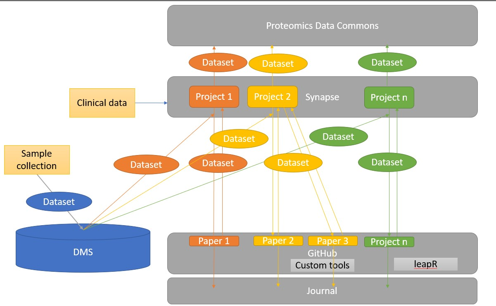

# The PNNL Proteomics Pipeline: P3
This project provides the basic analysis and tools for carrying out end-to-end proteomic analysis for data generated at PNNL. This repository will serve as a resource upon which we can build additional tools in a reusable fashion. Ideally we will include scripts and libraries that can be used as building blocks for future analysis.

## Overview

This section describes what you need to know to get started using this code base.

### To use this pipeline
This repository is only the basic structure of the tools needed, not the end-to-end analysis. Here are the steps you'll need to use this:

1- Read up on the tools
  - GitHub requires some basic protocols such as pull requests and commits, you should try to get a basic understanding. I found this [tutorial](https://medium.com/@jonathanmines/the-ultimate-github-collaboration-guide-df816e98fb67) that can serve as a starting point.
  - Synapse also has a bit of learning curve. To understand what Synapse is and isn't, check out [this document](https://docs.synapse.org/articles/getting_started.html).
2- Get [RStudio](http://rstudio.org). Basic R is essential, but RStudio will make your life a lot easier, I promise!
3- Install the [synapse python client](https://python-docs.synapse.org/build/html/index.html), create a [`.synapseConfig` file](https://python-docs.synapse.org/build/html/Credentials.html) in your home directory.
4- Click on the `Use this template` button above. This will allow you to create your own repository. Then you can follow the steps below.
5- Create a [new Synapse Project](https://docs.synapse.org/articles/getting_started.html#making-and-managing-projects-in-synapse) to store data for this project, or request access to an existing one.

### To contribute to this pipeline
Have something that we forgot? Great! Check out the [CONTRIBUTING.md](./CONTRIBUTING.md) document. We welcome all additional tool and methods. Then you can create a pull request and merge your code in.

## Pipeline description
This pipeline links together a series of data and code repositories to ensure that any data is saved for future use. Furthermore we hope to be able to reproduce the analysis for future projects. A brief overview of each tool is described here.

### Proteomics and phosphoproteomics processing
This processing relies on a series of customized `R` scripts that are in the [quantification/](./quantification) directory (documentation is [here](./quantification/README.md). Once this analysis is complete, the data should be stored on Synapse

### Synapse processing
Synapse is used for:
- data storage: data is backed up for free
- data processing: UUIDs and permission modifications allow for easy analysis
- data release: data can be moved to the PDC or shared

You will need to acquire a [synapse username](http://synapse.org/register) to access synapse, and become a [certified user](https://docs.synapse.org/articles/accounts_certified_users_and_profile_validation.html) to add data, but after that you will be set with future projects. We created a test site at http://synapse.org/p3.

### Functional analysis
There are typically a few steps we do for functional analysis. They are described in the [functional analysis](./functional) directory for now.
